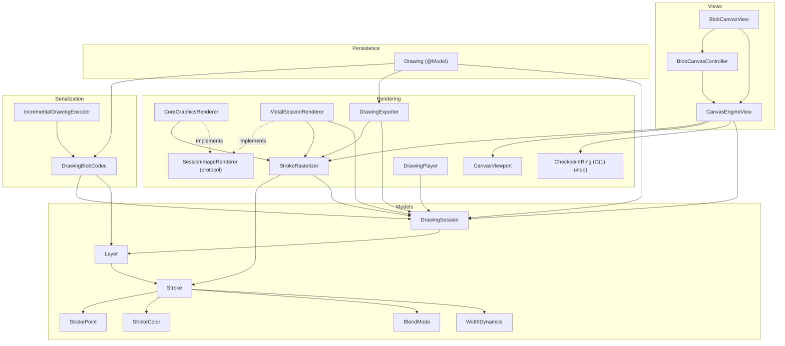

# BlobCanvas — Architecture

Deep reference for the drawing engine. For the quick map see [AGENTS.md](../AGENTS.md); for usage see [README.md](../README.md).

## Layers of the system

```
Input (touch / pencil / mouse, 120 Hz coalesced + predicted)
        │  view point ──► CanvasViewport.viewToCanvas ──► canvas point
        ▼
CanvasEngineView ── incremental joint ──► live buffer (opaque)
        │            predicted tail ────► predicted buffer
        │            eraser ────────────► committed buffer (destination-out)
        ▼  commit
DrawingSession  (layers → strokes; O(1) undo/redo on active layer)
        │  StrokeRasterizer.draw  (smoothed ribbon, single fillPath)
        ▼
committed buffer ──► present() blits committed + live + predicted (zoom/pan)
        │
        │  auto-save (debounced, off-main)
        ▼
DrawingBlobCodec / IncrementalDrawingEncoder  (delta+quantized, LZFSE)
        ▼
Drawing.compressedData  (SwiftData @Model, .externalStorage — one row per drawing)
```

Data-flow one-liner: **input → canvas-space points → DrawingSession (layers of strokes) → StrokeRasterizer geometry → pixel buffers on screen, and → binary blob on disk.**

## Code graph (module dependencies)

Grouped by directory; arrows mean "uses / depends on". Foundation value types at the bottom, UI at the top. Generated from the actual imports/type references.



Key property: **`Models` and `Rendering` have no UIKit/AppKit dependency**, so they're unit-tested headlessly (the golden-pixel render tests run without a view). Only `Views/` touches UIKit/AppKit.

## Rendering pipeline (Core Graphics)

`CanvasEngineView` owns three `CanvasBuffer`s, each an owned pixel buffer presented as a zero-copy `CGImage` over a persistent `CGDataProvider` (no per-frame `makeImage()` snapshot copy):

| Buffer | Holds | Written by |
|---|---|---|
| `committed` | all finished strokes, flattened | `rebake()` / `endStroke` fast-path / live eraser |
| `live` | current in-progress stroke (opaque) | `appendLivePoint` incremental joint |
| `predicted` | forecast tail from `predictedTouches` | `renderPredicted`, cleared each event |

`present()` blits `committed` (α=1) + `live` (α=brush alpha) + `predicted` (α=brush alpha) into the `CanvasViewport.drawnRect`. Translucency is correct because a whole stroke is one `fillPath` (single coverage) and the live overlay is composited once with its alpha.

`StrokeRasterizer` is the single source of ribbon geometry: a whole stroke is one **offset-outline contour** (left side forward, right side back) plus round-cap discs at the ends and at sharp turns — O(N) line segments, ~15–20× faster than an `addEllipse` per sample and hole-free by construction. All contours are wound to match `addEllipse` (via `signedArea`) so the single non-zero-winding fill computes a clean union. Catmull-Rom smoothing on commit, width from pressure/velocity/constant, `.normal`/`.erase` blend, and per-layer compositing (transparency groups so erasers stay layer-local).

**O(1) undo (`CheckpointRing`).** When `undoCheckpointDepth > 0`, each commit snapshots the pre-stroke `committed` pixels into a small ring keyed by the **active layer's** stroke count; undo restores that image instead of re-baking every stroke. Because the keys are per-active-layer counts, the ring is invalidated on any active-layer switch (`setActiveLayer`/`addLayer`, and implicitly via `rebake()` on `removeActiveLayer`/`moveLayer`/`clear`/`load`) — otherwise a checkpoint from one layer could match another layer's count and restore the wrong pixels. `take(key:)` only returns the newest matching checkpoint, so a non-contiguous undo falls back to a full re-bake.

**Backing-pixel budget.** `targetRenderScale()` bakes at `displayScale × zoom` but treats `maxBackingPixels` as a **hard ceiling** (`max(min(wanted, budget), 0.05)`): a canvas large enough that even native scale would exceed the budget renders slightly soft but bounded, rather than attempting a multi-GB allocation that would silently fail.

## Persistence & format

`DrawingBlobCodec` encodes a `DrawingSession` to `Drawing.compressedData` (`.externalStorage`). Points are quantized (1/32 pt, 8-bit pressure, 1 ms) and zig-zag-varint delta-coded, then LZFSE-compressed — several× smaller than raw `Float32` on real input.

Versions (all still decodable — `decode` dispatches per version):

| Version | Points | Structure |
|---|---|---|
| v1 | raw `Float32×4` | flat strokes |
| v2 | delta-varint | flat strokes, no flags |
| v3 | delta-varint | flat strokes + per-stroke flags |
| v4 | delta-varint | **layers** (current one-shot format) |
| v5 | delta-varint | **incremental**: per-layer sealed frames |

`IncrementalDrawingEncoder` (one per open drawing) seals strokes into compressed frames of `sealThreshold` (48) each; a save re-encodes only the small open tail, so autosave-per-stroke is not O(n²). Undo past a seal or layer removal re-compacts. A sealed frame is also rebuilt when its boundary stroke (`lastSealed`) no longer matches — catching an *undo-then-redraw between saves* that restores the stroke count but changes the content (redo restores the identical stroke and keeps the fast path; a genuinely new stroke invalidates it).

## Testing strategy

- **Codec:** round-trip (tolerance), stable re-encode (idempotent), legacy v1/v2 decode, implausible-count rejection, **fuzzing** (3000 hostile/corrupted decodes must never trap) via a seeded SplitMix64 RNG, and **safety hardening** (`CodecSafetyTests`: NaN/Inf canvas & brush, amplified counts, huge frame lengths, Int64 accumulator overflow — none may trap or OOM).
- **Incremental:** matches one-shot, undo recompacts, multi-layer, sealed frames reused.
- **Rendering (headless golden-pixel):** render session → `CGImage` → read a pixel → assert channels. Covers CG and Metal (skipped without a GPU), eraser clears, background fill, scale, layer opacity/visibility, Metal layer-local erase, CG↔Metal agreement for opaque strokes, and **stroke coverage vs a `CGContext.strokePath` reference** to catch winding holes.
- **Viewport:** fit centering, round-trip mapping, focal-point-preserving zoom, clamping, and the render-scale **pixel-budget ceiling** (incl. a huge canvas that must drop below native scale).
- **Regression (correctness pass):** undo-then-redraw at a seal boundary must not lose the new stroke; a layer switch must invalidate undo checkpoints (no cross-layer pixel restore); loading a drawing seeds the controller's mirror state **without** firing the autosave callback.

Незакрытые находки код-ревью (гонки сохранений, декомпрессионная бомба,
потеря данных при `snapshot()` без view) — в
[WEAK-SPOTS.md](WEAK-SPOTS.md).

## Improvements / known gaps

Recently closed: **O(N) offset-outline ribbon** (~15–20× faster rebake, hole-free), **white winding-holes on fast/dense strokes** (quad/outline wound to match caps), crisp zoom (re-bake at the zoom's resolution, capped by `maxBackingPixels`), O(1) undo (opt-in `undoCheckpointDepth` ring, rebake fallback), Intel-safe Metal read-back (`.private` → blit → shared buffer), incremental encoder keyed by `Layer.id`, Metal per-layer render (group opacity + layer-local erase) + smoothing, **SVG export of all layers** (was active-layer only), **layer-preserving replay**, Display P3 export.

Correctness pass (5 bugs, each with a regression test): incremental-encoder **data loss** on undo-then-redraw at a seal boundary (now checks the boundary stroke); **cross-layer checkpoint restore** wrong pixels (ring invalidated on active-layer switch); `BlobCanvasController` mirror state empty until first edit for a loaded drawing (now seeded on attach, without firing the autosave callback); iOS `touchesCancelled` committing an unintentional partial stroke (now discards); and `maxBackingPixels` **not enforced** for large canvases (budget is now a hard ceiling).

Still open, all device-bound: live `CAMetalLayer` view path (offscreen `MetalSessionRenderer` is the foundation), IOSurface presentation, canvas tiling. The Metal path now does Catmull-Rom smoothing, layer group opacity, and layer-local erase (via per-layer textures + a composite pass); the one remaining gap is per-stroke single-coverage translucency — a translucent stroke's self-overlaps can still double-blend on the GPU (the CG renderer handles this via a single fill).
